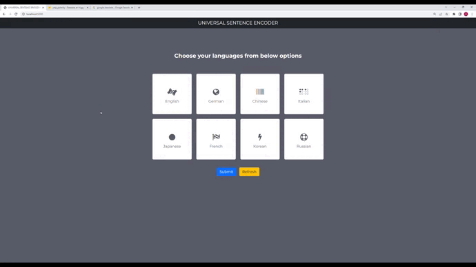

<p align="center">
 
 <h2 align="center">Cross-Lingual Text Classification</h2>
 <p align="center">Perform Cross-Lingual Text Classification on The Yelp reviews polarity dataset  consists of 560,000 trainig samples and 38,000 testing samples. Negative polarity is class 1, and positive class 2.</p>
  <p align="center">
 <a ></a>&nbsp
  <a ></a>&nbsp
    <a ></a>&nbsp
 <a target="_blank" ></a>&nbsp
 &nbsp
<a ></a>
<a ></a>


</p>

  <p align='center'>
   
  </p>
  
  --- 
  ## 🧐 About  Multilingual Universal Sentence Encoder 
  *  It is an extension of the Universal Sentence Encoder (USE) that was developed by Google. 
  * MUSE employs a transfer learning approach where it leverages the knowledge acquired from one language to benefit the understanding of other languages.
  * In this project  our model will be trained on english language, which can be used to classify text in another language.
  * By leveraging the shared sentence representations, the model can generalize its understanding of text across languages, making it a valuable tool for tasks like sentiment analysis, topic classification, and spam detection in multilingual environments.
  [Original Paper Link](https://arxiv.org/pdf/1907.04307.pdf) .
---

  ## 📖  Getting Started
  To install PyTorch, see installation instructions on the [PyTorch website](https://pytorch.org/get-started/locally).

To install requirements:

``` bash
pip install -r requirements.txt
```
 


## ⚙️ Tech Stack Used
1. Python 
2. Flask
3. Pytorch-lightning DL Framework
4. Transformer Model
5. BERT Tokenizer
6. Docker
---

## 📝 Infrastructure Required.

1. AWS S3
2. AWS EC2
3. AWS ECR
4. Git Actions
---

## 🚚 How to run?
Before we run the project, make sure that you are having AWS account(s3 bucket) because we are using s3 bucket for data storage with other services like S3, ECR and EC2 instances.


### ⭐️ Step 1: Clone the repository
```bash
git clone https://github.com/iNeuron-Pvt-Ltd/NLP-Project-Documentation.git
```

### ⭐️ Step 2- Create a conda environment after opening the repository

```bash
conda create -n venv python=3.8-y
```

```bash
conda activate venv
```

### ⭐️ Step 3 - Install the requirements
```bash
pip install -r requirements.txt
```

### ⭐️ Step 4 - Export the environment variable
```bash
export AWS_ACCESS_KEY_ID=<AWS_ACCESS_KEY_ID>

export AWS_SECRET_ACCESS_KEY=<AWS_SECRET_ACCESS_KEY>

export AWS_DEFAULT_REGION=<AWS_DEFAULT_REGION>


```

### ⭐️ Step 5 - Run the application server
```bash
python app.py
```

### ⭐️ Step 6. Prediction application
```bash
http://localhost:8080/

```
**Artifact** : Stores all artifacts created from running the application

**Components** : Contains all components of Machine Learning Project
- DataIngestion
- ModelTrainer


**Custom Logger and Exceptions** are used in the project for better debugging purposes.


## Take Aways

You now have a better understanding of 
-  Usage of hugging face transformers library.
-  Dockerize application.
-  Basic understanding Webframework like Flask.

=====================================================================